# PPE VI 视觉自动化系统 — 可持续迭代架构设计

> 目标：在不阻塞数据库与 AI 训练并行工作的前提下，建立可持续更新、可配置优化、易定位与修复问题的工程架构。
>
> 适用范围：一期 PC Web、管理后台、微信小程序及 AI 图像能力（AI-1 ~ AI-6）。

---

## 1. 总体决策

一期采用 **模块化单体（Modular Monolith）+ 异步任务中心 + 可替换 AI 适配层**，而不是一开始拆成多个微服务。

- 业务 API、权限、方案、素材、导出等稳定业务能力，统一部署为一个 Node.js 服务，便于快速开发、排错和事务一致性。
- AI 推理、训练、图片处理等耗时或依赖 GPU 的能力，独立为 Worker，通过队列异步调用，不能阻塞用户请求。
- 前后端、数据库、AI 之间仅通过 **版本化 API/事件契约** 协作；AI 服务不直接读写业务数据库。
- 业务规则、产品配置、Prompt、模板、尺寸规范均数据化，避免将易变规则写死在代码中。

这套架构的演进路径是：一期先保持一个清晰的业务服务；当 AI 调用量、导出量或某个业务模块成为瓶颈时，再按边界平滑拆出独立服务，而不是重写。

## 2. 总体架构

```mermaid
flowchart TB
    Admin[管理后台\n产品 / 模板 / 标定 / 配置]
    PC[PC 业务端\n画布 / 方案 / 生成 / 导出]
    MP[微信小程序\n简化画布 / 生成 / 下载]

    Admin --> API
    PC --> API
    MP --> API

    subgraph APP[应用层：模块化业务 API]
      API[API 网关 / BFF\n鉴权、参数校验、限流、版本控制]
      IAM[身份与租户模块]
      Product[产品与印刷规范模块]
      Asset[客户、素材与资产模块]
      Design[画布、模板与方案模块]
      Output[导出、分享与报价模块]
      Task[任务编排与通知模块]
      Ops[审计、监控与运营模块]
      API --> IAM
      API --> Product
      API --> Asset
      API --> Design
      API --> Output
      API --> Task
      API --> Ops
    end

    subgraph DATA[数据与基础设施]
      MySQL[(MySQL\n业务事实 / 版本 / 审计)]
      Redis[(Redis\n缓存 / 队列 / 限流)]
      OSS[(OSS\n原图 / 结果图 / 导出文件)]
    end

    Product --> MySQL
    Asset --> MySQL
    Design --> MySQL
    Output --> MySQL
    Ops --> MySQL
    APP --> Redis
    Asset --> OSS
    Output --> OSS

    Task --> Queue[任务队列\nBullMQ]
    Queue --> AIAdapter[AI 适配层\n统一任务协议]
    Queue --> Render[渲染 / 导出 Worker\nSharp / Puppeteer]
    AIAdapter --> AI[AI 服务\nComfyUI / Flux / 训练模型]
    AI --> OSS
    Render --> OSS
    AIAdapter --> Task
    Render --> Task
```



## 3. 模块边界与职责

模块以业务能力划分，而不是以页面或数据库表划分。每个模块只负责自己的规则、接口和数据访问，其他模块只能调用其公开服务，不允许跨模块直接操作表。

| 模块 | 核心职责 | 主要实体 / 输出 | 后续变化如何收敛 |
|---|---|---|---|
| 身份与租户 | 登录、角色、客户/租户数据隔离、权限校验 | user、role、tenant/customer scope | 新角色或客户隔离规则只改该模块和权限策略 |
| 产品与印刷规范 | 产品、分类、视角、可印刷面、标定网格、尺寸规范 | product、product_view、print_area | 新品类 / 新印刷规则由配置驱动，不改画布核心代码 |
| 客户与资产 | 客户档案、LOGO、图片、字体、素材归档 | customer、asset、logo | 所有资产使用统一 Asset ID，便于更换存储或增加素材类型 |
| 设计与方案 | 画布 JSON、编辑命令、模板、方案版本、回滚 | design、design_version、template | 画布格式单独版本化，旧方案可迁移与回放 |
| AI 编排 | 生成任务、优先级、重试、进度、结果回写、错误反馈 | generation_job、model_profile、feedback | 更换 Flux/ComfyUI/模型只替换 Adapter，不影响业务 API |
| 渲染与导出 | 贴图合成、缩略图、水印、多尺寸图、PDF、报价单 | render_job、export_file | 导出样式用模板与参数配置，不将版式散落在业务代码中 |
| 分享与展示 | 分享链接、密码、有效期、访问日志、KA 展示 | share_link、access_log | 分享渠道或权限政策变化不影响方案/导出模块 |
| 运营与可观测性 | 审计日志、任务耗时、埋点、告警、看板 | audit_log、metric_event | 用统一事件和错误码支持定位、扩容和产品优化 |

## 4. 三条核心业务链路

### 4.1 设计与贴图链路（同步优先）

1. 用户选择产品、视角和印刷面；系统从产品规范读取允许区域、尺寸和标定数据。
2. 画布只保存“元素 + 参数 + 资源引用”的 JSON，不保存不可追溯的图片状态。
3. 前端使用低精度预览实现即时拖拽；提交导出时，服务端按同一份渲染参数进行高精度合成。
4. 每次保存生成不可变 `design_version` 快照，可查看差异、回滚、从旧版本创建新方案。

**关键原则：** 产品标定、尺寸限制和透视参数属于产品配置；画布只消费配置，不自行判断品类规则。

### 4.2 AI 生成与训练链路（异步任务）

1. 前端提交“生成意图”，API 创建 `generation_job` 并立即返回 `job_id`。
2. 队列按优先级（例如 KA 演示优先）分发至 AI Worker；Worker 从 OSS 读取已授权的输入资源。
3. AI Worker 通过统一 Adapter 调用 ComfyUI/Flux 或后续模型，状态写回任务中心：`queued → running → succeeded / failed / cancelled`。
4. 结果图先落 OSS，再由任务中心登记 Asset 与结果元数据；前端经 WebSocket 或轮询取得进度。
5. 用户“生成错误反馈”绑定 `job_id`、模型版本、Prompt、输入资产版本和备注，形成可复现的训练/调参工单。

**关键原则：**

- 训练与推理必须登记 `model_profile_id`、数据集版本、工作流版本、Prompt 版本和参数快照。
- AI 服务不得直接写 `products`、`designs` 等业务表；所有业务状态由 API/任务中心更新。
- “AI 记忆”实现为可审计的产品参数档案与模型版本绑定，而不是不可追溯的在线学习。

### 4.3 导出与分享链路（可追溯）

1. 用户选择方案版本和导出规格；系统创建 `export_job`，固定输入版本和模板版本。
2. Render Worker 生成 PNG/JPG/PDF，最后统一叠加水印并存入 OSS。
3. 输出文件记录来源方案、渲染参数、模板版本和创建人，确保以后可以复现。
4. 分享链接只指向导出资产：随机 Token、有效期、可选密码、访问频控和访问日志均由分享模块管理。

## 5. 与数据库同事的协作契约

数据库设计应以领域边界和数据所有权为准。建议由数据库同事出表结构与索引方案，应用侧共同确认以下最小契约。

| 数据域 | 建议核心表 | 负责模块 | 关键约束 |
|---|---|---|---|
| 租户与权限 | tenants、users、roles、user_roles | 身份与租户 | 业务表都带 `tenant_id` 或可推导归属；查询强制隔离 |
| 产品规范 | products、categories、product_categories、product_views、print_areas | 产品与印刷规范 | `print_areas` 保存标定网格、mm↔px 系数、尺寸规则版本 |
| 资产 | assets、logos、fonts、asset_versions | 客户与资产 | OSS Key 不等于业务 ID；删除采用软删除 + 引用检查 |
| 方案 | designs、design_versions、templates、template_versions | 设计与方案 | 画布 JSON 和 schema version 必须随版本快照保存 |
| AI | generation_jobs、model_profiles、prompt_versions、ai_feedback | AI 编排 | 任务输入、参数、模型与结果必须可关联、可复现 |
| 输出与分享 | export_jobs、exports、share_links、share_access_logs | 导出与分享 | 导出固定来源版本；Token 不保存明文密码 |
| 运营 | audit_logs、metric_events | 运营与可观测性 | 审计日志只追加，不允许业务模块修改历史 |

统一字段建议：`id`、`tenant_id`、`created_at`、`created_by`、`updated_at`、`updated_by`、`status`、`deleted_at`（适用时）。所有写操作在业务层记录 `audit_log`；大对象只放 OSS，MySQL 保存元数据和引用。

### 数据库协作的四项强制约定

1. **不允许前端直连数据库，不允许 AI Worker 绕过 API 写业务表。**
2. **每一次结构变更必须有迁移文件。** 迁移与应用版本同时发布，可回滚并在预发环境演练。
3. **JSON 只用于可变配置和画布快照。** 高查询、高关联字段必须结构化建表并建立索引。
4. **所有外部资源用逻辑 ID 引用。** OSS 路径、模型路径和临时 URL 都是实现细节，可替换且不应污染业务对象。

## 6. 与 AI 训练同事的协作契约

AI 同事只需要遵守一套稳定的任务协议，内部可以独立调整 ComfyUI 工作流、模型、GPU 和训练方式。

### 6.1 统一任务输入

```json
{
  "jobId": "gen_01H...",
  "type": "image_generation",
  "tenantId": "tenant_...",
  "modelProfileId": "model_profile_v3",
  "workflowVersion": "wearing-v2.1",
  "inputAssets": [
    { "assetId": "asset_product_view", "role": "product_reference", "version": 4 },
    { "assetId": "asset_design", "role": "printed_design", "version": 2 }
  ],
  "parameters": {
    "sceneTemplateId": "construction-site-v1",
    "modelPresetId": "male-worker-a",
    "promptVersion": "product-helmet-v5",
    "seed": 123456
  },
  "callback": "internal://task-center/jobs/gen_01H.../events"
}
```

### 6.2 统一状态与回调

- 状态只使用：`queued`、`running`、`succeeded`、`failed`、`cancelled`、`timed_out`。
- 回调必须携带 `jobId`、阶段、进度、耗时、错误码、可读错误信息、模型/工作流版本。
- 成功结果先上传指定 OSS 前缀，再回调 `assetKey`、宽高、hash、缩略图信息；任务中心校验后登记为业务 Asset。
- 失败必须区分：输入不合法、资源不足、模型异常、超时、可重试网络异常；是否重试由任务中心决定。

### 6.3 AI 侧必须交付的可维护资料

- 每条工作流的输入/输出定义、参数范围、资源需求和超时建议。
- 每个模型/LoRA 的版本、训练集版本、适用产品、已知限制和回滚模型。
- 固定验收样本集与每周回归结果：抠图、贴图、穿戴、生图、印标保真。
- 可观测日志：`job_id` 贯穿 API、队列、Worker、ComfyUI 和输出文件。

## 7. 前后端模块化规范

推荐使用 Monorepo 管理共享契约，减少 PC、后台、小程序与后端的类型漂移。

```text
apps/
  admin-web/                 # 管理后台
  pc-web/                    # 业务端画布与方案
  miniapp/                   # 小程序（能力按范围降级）
  api/                       # Node.js / Express 模块化业务 API
  ai-worker/                 # AI 任务 Adapter 与 Worker
  render-worker/             # 导出、PDF、缩略图、合图
packages/
  api-contracts/             # OpenAPI / DTO / 错误码 / 事件契约
  domain-types/              # 不依赖框架的领域类型与规则
  canvas-core/               # 画布 JSON schema、命令、迁移、渲染参数
  ui/                        # 可复用 UI 与设计令牌
  config/                    # 环境配置校验、功能开关定义
infra/
  docker/ ci/ nginx/ monitor/
docs/
  architecture/ openapi/ adr/ runbook/
```

后端每个业务模块固定分层：`router → controller → application service → domain → repository`。

- `router/controller`：鉴权、参数校验、HTTP 协议转换；不放业务规则。
- `application service`：编排用例、事务、调用其他模块公开服务和投递事件。
- `domain`：尺寸校验、状态机、版本规则等纯业务规则，优先可单元测试。
- `repository`：唯一可访问数据库的层；禁止在 controller 中拼 SQL。
- `adapter`：OSS、Redis、AI、邮件/消息等外部依赖的实现；接口可替换、可 Mock。

前端以领域拆分 `features/products`、`features/assets`、`features/designs`、`features/generation`、`features/exports`，不以“一个巨大 components 目录”组织。画布编辑器要将交互命令、画布 JSON、渲染参数、API 调用分开，防止 Fabric.js 细节扩散到业务页面。

## 8. 让业务可持续更新的机制

| 变化类型 | 放置位置 | 例子 |
|---|---|---|
| 产品规则变化 | 产品/印刷规范配置 | 品类视角数、可印刷面、尺寸范围、标定网格 |
| 视觉与模板变化 | 模板版本与导出模板 | 行业模板、KA 版式、水印、PDF 报价单 |
| AI 策略变化 | Prompt / 工作流 / 模型档案版本 | 人模、场景、负向词、LoRA、回贴策略 |
| 渠道范围变化 | 功能开关与权限策略 | 小程序先关闭复杂画布、KA 客户优先队列 |
| API 演进 | `/api/v1` 版本与兼容期 | 新画布字段、新导出规格不破坏旧客户端 |

配置变更必须有发布人、发布时间、版本号、适用范围和回滚版本；影响生成结果的配置必须写入任务和输出快照，不能只读取“当前值”。

## 9. 让需求方方便优化的机制

1. 管理后台提供产品、印刷区、尺寸、Prompt、模型档案、场景、人模、模板和导出规格的配置入口，并按角色授权。
2. 每条 AI 任务保存耗时、排队时间、输入、模型/Prompt 版本、成功/失败原因与人工评分；看板直接显示成功率、P95 耗时和高频错误。
3. 用户反馈必须关联具体方案版本和任务版本，避免“这张图不好”无法复现。
4. 每次优化通过灰度开关先作用于指定租户/产品/内部人员，对比通过后再全量发布；异常可一键回滚到旧版本。
5. 画布与模板格式采用 schema version；系统对旧方案自动迁移，迁移失败保留只读回放能力。

## 10. 让 Bug 容易定位和修复的机制

### 必做工程基线

- **全链路追踪 ID**：每次请求生成 `trace_id`，AI/导出任务再生成 `job_id`；日志、审计、队列与输出文件均能通过 ID 串联。
- **结构化日志与统一错误码**：错误包含模块、操作、资源 ID、租户、`trace_id`，不得只记录“操作失败”。
- **任务状态机与幂等**：重复提交、消息重复投递、回调重复均不会生成重复资产或覆盖结果。
- **分级重试与死信队列**：网络异常可退避重试；参数错误不重试；超限任务入死信并告警。
- **测试分层**：领域规则单测、模块 API 集成测试、三条主链路 E2E、AI 验收样本回归、租户越权测试、备份恢复演练。
- **发布可回退**：数据库迁移、应用、Worker、模型/工作流均独立版本化；生产发布保留上一个可运行版本。

### 需要建立的运行手册（Runbook）

1. AI 任务堆积 / GPU 不可用时的排障与降级步骤。
2. OSS 上传或回调失败时的补偿与孤儿文件清理流程。
3. 导出失败、分享失效、方案版本迁移失败的人工处理流程。
4. 数据库备份恢复、权限越权、敏感素材误删的应急流程。

## 11. 三方本周即可开始的交付清单

| 角色 | 本周交付 | 验收标准 |
|---|---|---|
| 产品/架构 | 本文确认、模块边界、状态机、错误码和配置项清单 | 三方不存在“谁负责写哪张表 / 调哪个接口”的模糊地带 |
| 数据库同事 | ER 图、字段字典、索引与迁移初稿 | 覆盖第 5 节全部数据域，明确表所有者与租户隔离方式 |
| AI 同事 | AI-1/AI-3/AI-4 PoC 的任务协议、回调样例、模型版本登记格式 | 能通过 `job_id` 提交、查询进度、保存结果、复现一次生成 |
| 后端 | OpenAPI v1、任务中心最小闭环、OSS 临时上传 | 前端可独立联调，不等待真实 AI 完成 |
| 前端 | 画布 JSON schema、Mock API、任务状态 UI | 可用 Mock 走通产品→设计→提交任务→展示结果 |
| 测试/PM | 验收样本集、指标对照表、异常场景清单 | AI 指标和业务验收有固定样本、固定口径 |

## 12. 首期架构验收标准

在 MS1 前完成以下最小闭环，即可认为架构已落地而非停留在文档：

1. OpenAPI v1 和任务回调协议已冻结，并由前端、数据库、AI 三方评审。
2. 以 Mock AI Worker 跑通：创建生成任务、排队、进度更新、失败重试、结果登记和页面展示。
3. 产品视角、印刷区标定、画布 JSON、方案版本、导出任务能通过 ID 串联追溯。
4. 任意业务查询均经过租户/客户隔离；至少具备 2 个越权自动化测试用例。
5. 用一个 `trace_id` 能定位一次“用户点击生成 → 队列 → AI Worker → OSS 结果 → 前端展示”的完整过程。

---

## 结论

真正需要长期稳定的不是某一个模型或某一张表，而是“**业务规则可配置、异步任务可追溯、AI 能替换、版本能回滚、故障能定位**”这五个边界。按本文分工后，数据库与 AI 可以独立推进，前后端可先用 Mock 契约开发，后续模型、产品品类和业务模板变化都不会牵动核心代码。
